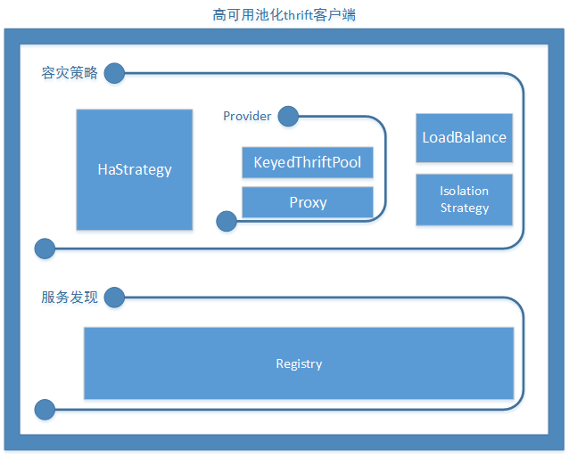

#forest-thrift
thrift服务的简单的封装

##thrift-client

池化的高可用thrift客户端

### future

- 支持连接池
- 支持thrift描述文件的ping校验
- 支持负载均衡策略
- 支持容灾策略
- 支持自动熔断策略
- 支持基于zk的服务发现


### quick start

maven依赖

```xml
<dependency>
    <groupId>com.zhizus.forest.thrift</groupId>
    <artifactId>thrift-client</artifactId>
    <version>0.0.1</version>
</dependency>
```



使用示例：

``` java
// 连接池配置，
    GenericKeyedObjectPoolConfig poolConfig = new GenericKeyedObjectPoolConfig();

    // 校验接口，连接池的validateObject方法会调用到这里的ping方法
    // 这里主要用于对thrift描述文件层面的心跳校验支持
    PingValidate pingValidate = new PingValidate() {
        @Override
        public boolean ping(ServerInfo key, TTransport transport) {
            return true;
        }
    };
    // 客户端熔断策略，默认1min中10次异常则自动熔断，恢复时间也为1min中
    IsolationStrategy<ServerInfo> infoIsolationStrategy = new IsolationStrategy<>();

    DefaultThriftClient thriftClient = new DefaultThriftClient(LoadBalanceType.RANDOM, HAStrategyType.FAILED_FAST,
            new ConfRegistry("localhost:9999"), poolConfig, pingValidate, infoIsolationStrategy);
    //每次使用client请调用iface接口，这里通过代理模式包装了异常统计和回池操作，一个 iface生成的代理对象调用多次会出现问题
    //  thriftClient.iface(YourThrift.class);
```


## thrift-server

## 更多示例


